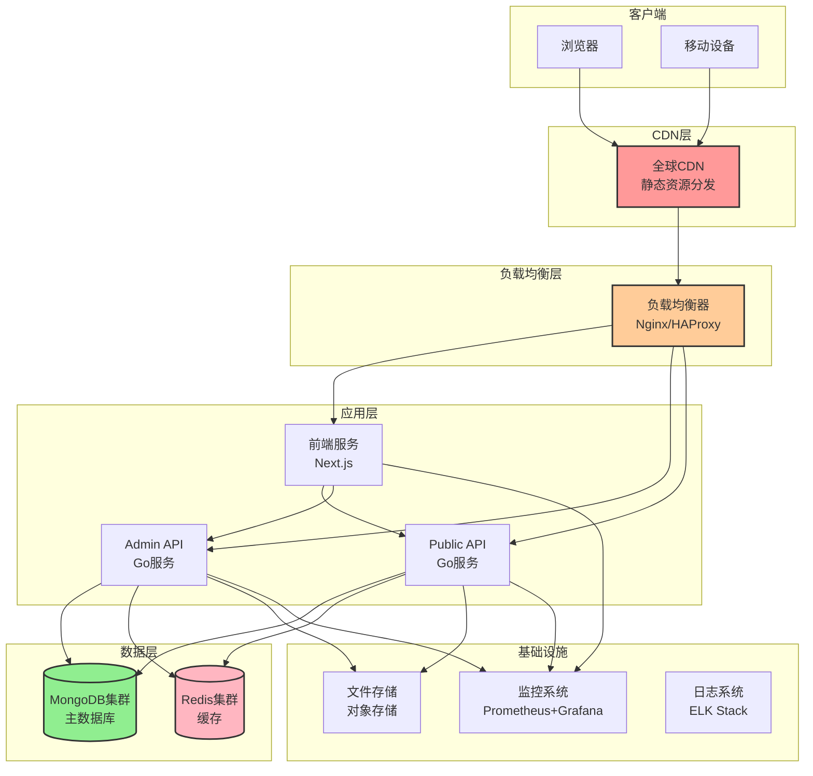

# 部署与运维设计 (Deployment & DevOps Design)

本文档定义了 Heimdall 博客系统的部署架构、CI/CD流程、监控体系和运维规范。

## 1. 部署架构概览

### 1.1. 整体架构图



### 1.2. 环境规划

**开发环境 (Development)**:
- 本地开发环境
- Docker Compose一键启动
- 热重载和调试支持
- 种子数据自动初始化

**测试环境 (Testing)**:
- 自动化测试环境
- CI/CD集成测试
- 性能测试环境
- 安全扫描环境

**预发布环境 (Staging)**:
- 生产环境镜像
- 发布前验证
- 用户验收测试
- 性能压测

**生产环境 (Production)**:
- 高可用部署
- 自动扩缩容
- 监控告警
- 备份恢复

## 2. 容器化设计

### 2.1. Docker镜像设计

**多阶段构建优化**:
```dockerfile
# Admin API Dockerfile
FROM golang:1.24-alpine AS builder
WORKDIR /app
COPY go.mod go.sum ./
RUN go mod download
COPY . .
RUN CGO_ENABLED=0 GOOS=linux go build -o admin-api ./admin-api/admin

FROM alpine:latest
RUN apk --no-cache add ca-certificates tzdata
WORKDIR /root/
COPY --from=builder /app/admin-api .
COPY --from=builder /app/admin-api/admin/etc/admin-api.yaml ./etc/
EXPOSE 8080
CMD ["./admin-api", "-f", "etc/admin-api.yaml"]
```

**前端服务镜像**:
```dockerfile
# Frontend Dockerfile
FROM node:18-alpine AS builder
WORKDIR /app
COPY package*.json ./
RUN npm ci --only=production
COPY . .
RUN npm run build

FROM node:18-alpine
WORKDIR /app
COPY --from=builder /app/.next ./.next
COPY --from=builder /app/public ./public
COPY --from=builder /app/package.json ./
COPY --from=builder /app/node_modules ./node_modules
EXPOSE 3000
CMD ["npm", "start"]
```

### 2.2. Docker Compose配置

**开发环境配置**:
```yaml
# docker-compose.dev.yml
version: '3.8'
services:
  mongodb:
    image: mongo:7.0
    container_name: heimdall-mongo
    ports:
      - "27017:27017"
    environment:
      MONGO_INITDB_ROOT_USERNAME: root
      MONGO_INITDB_ROOT_PASSWORD: password
    volumes:
      - mongo_data:/data/db
      - ./scripts/db:/docker-entrypoint-initdb.d
    networks:
      - heimdall-network

  redis:
    image: redis:7.0-alpine
    container_name: heimdall-redis
    ports:
      - "6379:6379"
    command: redis-server --appendonly yes
    volumes:
      - redis_data:/data
    networks:
      - heimdall-network

  admin-api:
    build:
      context: .
      dockerfile: docker/Dockerfile.admin
    container_name: heimdall-admin-api
    ports:
      - "8080:8080"
    environment:
      - DB_HOST=mongodb
      - REDIS_HOST=redis
    depends_on:
      - mongodb
      - redis
    volumes:
      - ./admin-api/admin/etc:/app/etc
    networks:
      - heimdall-network

  public-api:
    build:
      context: .
      dockerfile: docker/Dockerfile.public
    container_name: heimdall-public-api
    ports:
      - "8081:8081"
    environment:
      - DB_HOST=mongodb
      - REDIS_HOST=redis
    depends_on:
      - mongodb
      - redis
    volumes:
      - ./public-api/public/etc:/app/etc
    networks:
      - heimdall-network

volumes:
  mongo_data:
  redis_data:

networks:
  heimdall-network:
    driver: bridge
```

## 3. CI/CD流程设计

### 3.1. GitHub Actions工作流

**主工作流配置**:
```yaml
# .github/workflows/ci-cd.yml
name: CI/CD Pipeline

on:
  push:
    branches: [main, develop]
  pull_request:
    branches: [main]

jobs:
  # 代码质量检查
  quality-check:
    runs-on: ubuntu-latest
    steps:
      - uses: actions/checkout@v4
      
      - name: Setup Go
        uses: actions/setup-go@v4
        with:
          go-version: '1.24'
      
      - name: Install dependencies
        run: go mod download
      
      - name: Run linter
        run: |
          go install github.com/golangci/golangci-lint/cmd/golangci-lint@latest
          golangci-lint run
      
      - name: Run security scan
        run: |
          go install github.com/securecodewarrior/gosec/v2/cmd/gosec@latest
          gosec ./...

  # 单元测试
  unit-tests:
    runs-on: ubuntu-latest
    needs: quality-check
    steps:
      - uses: actions/checkout@v4
      
      - name: Setup Go
        uses: actions/setup-go@v4
        with:
          go-version: '1.24'
      
      - name: Run tests
        run: |
          go test -v -race -coverprofile=coverage.out ./...
          go tool cover -html=coverage.out -o coverage.html
      
      - name: Upload coverage
        uses: codecov/codecov-action@v3
        with:
          file: coverage.out

  # 构建镜像
  build-images:
    runs-on: ubuntu-latest
    needs: [quality-check, unit-tests]
    steps:
      - uses: actions/checkout@v4
      
      - name: Set up Docker Buildx
        uses: docker/setup-buildx-action@v3
      
      - name: Login to Registry
        uses: docker/login-action@v3
        with:
          registry: ${{ secrets.DOCKER_REGISTRY }}
          username: ${{ secrets.DOCKER_USERNAME }}
          password: ${{ secrets.DOCKER_PASSWORD }}
      
      - name: Build and push Admin API
        uses: docker/build-push-action@v5
        with:
          context: .
          file: docker/Dockerfile.admin
          push: true
          tags: |
            ${{ secrets.DOCKER_REGISTRY }}/heimdall-admin-api:${{ github.sha }}
            ${{ secrets.DOCKER_REGISTRY }}/heimdall-admin-api:latest
      
      - name: Build and push Public API
        uses: docker/build-push-action@v5
        with:
          context: .
          file: docker/Dockerfile.public
          push: true
          tags: |
            ${{ secrets.DOCKER_REGISTRY }}/heimdall-public-api:${{ github.sha }}
            ${{ secrets.DOCKER_REGISTRY }}/heimdall-public-api:latest

  # 部署到测试环境
  deploy-staging:
    runs-on: ubuntu-latest
    needs: build-images
    if: github.ref == 'refs/heads/develop'
    environment: staging
    steps:
      - name: Deploy to staging
        run: |
          # 部署到测试环境的脚本
          echo "Deploying to staging environment"

  # 部署到生产环境
  deploy-production:
    runs-on: ubuntu-latest
    needs: build-images
    if: github.ref == 'refs/heads/main'
    environment: production
    steps:
      - name: Deploy to production
        run: |
          # 部署到生产环境的脚本
          echo "Deploying to production environment"
```

### 3.2. 部署策略

**蓝绿部署**:
- 零停机部署
- 快速回滚能力
- 生产环境验证

**滚动更新**:
- 渐进式部署
- 自动健康检查
- 失败自动回滚

**金丝雀发布**:
- 小流量验证
- 逐步扩大范围
- A/B测试支持

## 4. Kubernetes部署

### 4.1. 资源清单

**Admin API部署**:
```yaml
# k8s/admin-api-deployment.yaml
apiVersion: apps/v1
kind: Deployment
metadata:
  name: admin-api
  namespace: heimdall
spec:
  replicas: 3
  selector:
    matchLabels:
      app: admin-api
  template:
    metadata:
      labels:
        app: admin-api
    spec:
      containers:
      - name: admin-api
        image: registry.example.com/heimdall-admin-api:latest
        ports:
        - containerPort: 8080
        env:
        - name: DB_HOST
          valueFrom:
            secretKeyRef:
              name: db-config
              key: host
        - name: DB_PASSWORD
          valueFrom:
            secretKeyRef:
              name: db-config
              key: password
        resources:
          requests:
            memory: "128Mi"
            cpu: "100m"
          limits:
            memory: "512Mi"
            cpu: "500m"
        livenessProbe:
          httpGet:
            path: /health
            port: 8080
          initialDelaySeconds: 30
          periodSeconds: 10
        readinessProbe:
          httpGet:
            path: /ready
            port: 8080
          initialDelaySeconds: 5
          periodSeconds: 5

---
apiVersion: v1
kind: Service
metadata:
  name: admin-api-service
  namespace: heimdall
spec:
  selector:
    app: admin-api
  ports:
  - protocol: TCP
    port: 80
    targetPort: 8080
  type: ClusterIP

---
apiVersion: networking.k8s.io/v1
kind: Ingress
metadata:
  name: admin-api-ingress
  namespace: heimdall
  annotations:
    nginx.ingress.kubernetes.io/ssl-redirect: "true"
    nginx.ingress.kubernetes.io/auth-type: basic
    nginx.ingress.kubernetes.io/auth-secret: admin-auth
spec:
  tls:
  - hosts:
    - admin.example.com
    secretName: admin-tls
  rules:
  - host: admin.example.com
    http:
      paths:
      - path: /
        pathType: Prefix
        backend:
          service:
            name: admin-api-service
            port:
              number: 80
```

### 4.2. 配置管理

#### ⚠️ 重要提醒：Go-Zero配置字段冲突

在设计应用配置时，必须避免与go-zero框架内置字段冲突。以下字段名已被框架占用：
- `Log` - 框架日志配置
- `Timeout` - 框架超时配置  
- `Host`/`Port` - 服务监听配置

**正确的ConfigMap配置**:
```yaml
# k8s/config-map.yaml
apiVersion: v1
kind: ConfigMap
metadata:
  name: app-config
  namespace: heimdall
data:
  app.yaml: |
    server:
      port: 8080
      readTimeout: 30s    # 避免使用 timeout
      writeTimeout: 30s
    cache:
      ttl: 3600
    # 使用 logConfig 而不是 log
    logConfig:
      level: info
      format: json
    # 应用层面的超时配置
    timeoutConfig:
      database: 10s
      redis: 5s
```

**Secret管理**:
```yaml
# k8s/secrets.yaml
apiVersion: v1
kind: Secret
metadata:
  name: db-config
  namespace: heimdall
type: Opaque
data:
  host: <base64-encoded-host>
  username: <base64-encoded-username>
  password: <base64-encoded-password>
  jwt-secret: <base64-encoded-jwt-secret>
```

## 5. 监控和日志

### 5.1. Prometheus监控

**服务监控配置**:
```yaml
# monitoring/prometheus-config.yaml
global:
  scrape_interval: 15s
  evaluation_interval: 15s

scrape_configs:
  - job_name: 'admin-api'
    static_configs:
      - targets: ['admin-api:8080']
    metrics_path: /metrics
    scrape_interval: 10s
    
  - job_name: 'public-api'
    static_configs:
      - targets: ['public-api:8081']
    metrics_path: /metrics
    scrape_interval: 10s

  - job_name: 'mongodb'
    static_configs:
      - targets: ['mongodb-exporter:9216']

  - job_name: 'redis'
    static_configs:
      - targets: ['redis-exporter:9121']

rule_files:
  - "alert_rules.yml"

alerting:
  alertmanagers:
    - static_configs:
        - targets:
          - alertmanager:9093
```

**告警规则**:
```yaml
# monitoring/alert-rules.yml
groups:
- name: heimdall-alerts
  rules:
  # 服务可用性告警
  - alert: ServiceDown
    expr: up == 0
    for: 1m
    labels:
      severity: critical
    annotations:
      summary: "Service {{ $labels.job }} is down"
      description: "{{ $labels.job }} has been down for more than 1 minute."

  # API响应时间告警
  - alert: HighResponseTime
    expr: histogram_quantile(0.95, rate(http_request_duration_seconds_bucket[5m])) > 1
    for: 5m
    labels:
      severity: warning
    annotations:
      summary: "High response time on {{ $labels.job }}"
      description: "95th percentile response time is {{ $value }}s"

  # 错误率告警
  - alert: HighErrorRate
    expr: rate(http_requests_total{status=~"5.."}[5m]) / rate(http_requests_total[5m]) > 0.1
    for: 2m
    labels:
      severity: critical
    annotations:
      summary: "High error rate on {{ $labels.job }}"
      description: "Error rate is {{ $value | humanizePercentage }}"

  # 内存使用告警
  - alert: HighMemoryUsage
    expr: (container_memory_usage_bytes / container_spec_memory_limit_bytes) > 0.9
    for: 5m
    labels:
      severity: warning
    annotations:
      summary: "High memory usage"
      description: "Memory usage is above 90%"
```

### 5.2. Grafana仪表板

**关键指标监控**:
- API QPS和响应时间
- 错误率和成功率
- 数据库连接池状态
- Redis缓存命中率
- 内存和CPU使用率
- 磁盘空间使用率

### 5.3. 日志系统

**ELK Stack配置**:
```yaml
# logging/filebeat.yml
filebeat.inputs:
- type: container
  paths:
    - '/var/lib/docker/containers/*/*.log'
  processors:
  - add_docker_metadata:
      host: "unix:///var/run/docker.sock"

output.elasticsearch:
  hosts: ["elasticsearch:9200"]
  index: "heimdall-logs-%{+yyyy.MM.dd}"

logging.level: info
```

## 6. 备份与恢复

### 6.1. 数据备份策略

**MongoDB备份**:
```bash
#!/bin/bash
# scripts/backup-mongodb.sh

BACKUP_DIR="/backup/mongodb"
DATE=$(date +%Y%m%d_%H%M%S)
BACKUP_NAME="heimdall_backup_$DATE"

# 创建备份目录
mkdir -p $BACKUP_DIR

# 执行备份
mongodump --host mongodb:27017 \
  --username $MONGO_USERNAME \
  --password $MONGO_PASSWORD \
  --db heimdall \
  --out $BACKUP_DIR/$BACKUP_NAME

# 压缩备份文件
tar -czf $BACKUP_DIR/$BACKUP_NAME.tar.gz -C $BACKUP_DIR $BACKUP_NAME

# 删除超过7天的备份
find $BACKUP_DIR -name "*.tar.gz" -mtime +7 -delete

# 上传到云存储
aws s3 cp $BACKUP_DIR/$BACKUP_NAME.tar.gz s3://heimdall-backups/mongodb/
```

**Redis备份**:
```bash
#!/bin/bash
# scripts/backup-redis.sh

BACKUP_DIR="/backup/redis"
DATE=$(date +%Y%m%d_%H%M%S)

mkdir -p $BACKUP_DIR

# 保存Redis快照
redis-cli --rdb $BACKUP_DIR/dump_$DATE.rdb

# 上传到云存储
aws s3 cp $BACKUP_DIR/dump_$DATE.rdb s3://heimdall-backups/redis/
```

### 6.2. 灾难恢复计划

**恢复流程**:
1. 评估故障范围和影响
2. 启动灾难恢复流程
3. 从备份恢复数据
4. 重新部署应用服务
5. 验证系统功能完整性
6. 切换流量到恢复环境

**RTO/RPO指标**:
- RTO (Recovery Time Objective): 30分钟
- RPO (Recovery Point Objective): 4小时

## 7. 安全和合规

### 7.1. 容器安全

**镜像安全扫描**:
```yaml
# .github/workflows/security-scan.yml
name: Security Scan

on:
  push:
    branches: [main, develop]

jobs:
  security-scan:
    runs-on: ubuntu-latest
    steps:
      - uses: actions/checkout@v4
      
      - name: Run Trivy vulnerability scanner
        uses: aquasecurity/trivy-action@master
        with:
          image-ref: 'heimdall-admin-api:latest'
          format: 'sarif'
          output: 'trivy-results.sarif'
      
      - name: Upload Trivy scan results
        uses: github/codeql-action/upload-sarif@v2
        with:
          sarif_file: 'trivy-results.sarif'
```

### 7.2. 网络安全

**网络策略**:
```yaml
# k8s/network-policy.yaml
apiVersion: networking.k8s.io/v1
kind: NetworkPolicy
metadata:
  name: heimdall-network-policy
  namespace: heimdall
spec:
  podSelector: {}
  policyTypes:
  - Ingress
  - Egress
  ingress:
  - from:
    - namespaceSelector:
        matchLabels:
          name: ingress-nginx
    ports:
    - protocol: TCP
      port: 8080
  egress:
  - to:
    - namespaceSelector:
        matchLabels:
          name: database
    ports:
    - protocol: TCP
      port: 27017
```

## 8. 成本优化

### 8.1. 资源优化

**自动扩缩容**:
```yaml
# k8s/hpa.yaml
apiVersion: autoscaling/v2
kind: HorizontalPodAutoscaler
metadata:
  name: admin-api-hpa
  namespace: heimdall
spec:
  scaleTargetRef:
    apiVersion: apps/v1
    kind: Deployment
    name: admin-api
  minReplicas: 2
  maxReplicas: 10
  metrics:
  - type: Resource
    resource:
      name: cpu
      target:
        type: Utilization
        averageUtilization: 70
  - type: Resource
    resource:
      name: memory
      target:
        type: Utilization
        averageUtilization: 80
```

### 8.2. 成本监控

**资源使用分析**:
- 按服务统计资源消耗
- 成本分摊和预算控制
- 闲置资源清理
- 预留实例优化

---

**注意**: 本文档涵盖了从开发到生产的完整DevOps流程，应根据实际基础设施和团队能力进行调整和优化。建议从简单的部署方式开始，逐步演进到更复杂的架构。 