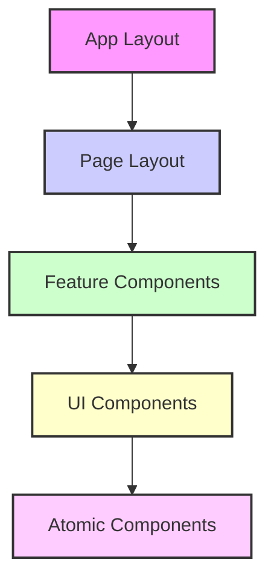

# 前端架构设计 (Frontend Architecture Design)

本文档定义了 Heimdall 博客系统前端的技术架构、组件设计和开发规范。

## 1. 技术架构概览

### 1.1. 技术栈选型

**核心框架**:
- **前端框架**: Next.js 14+ (App Router)
- **语言**: TypeScript 5.0+
- **样式方案**: Tailwind CSS + CSS Modules
- **状态管理**: Zustand + React Query
- **构建工具**: Next.js内置 + Turbopack

**开发工具**:
- **代码质量**: ESLint + Prettier + Husky
- **测试框架**: Jest + React Testing Library
- **类型检查**: TypeScript strict mode
- **包管理**: pnpm

### 1.2. 项目结构

```
blog-frontend/
├── package.json
├── tsconfig.json
├── tailwind.config.js
├── next.config.js
├── src/
│   ├── app/                    # App Router (Next.js 14+)
│   │   ├── (admin)/           # 管理后台路由组
│   │   ├── (public)/          # 公开博客路由组
│   │   ├── api/               # API路由 (如果需要)
│   │   ├── globals.css        # 全局样式
│   │   └── layout.tsx         # 根布局
│   ├── components/            # 通用组件
│   │   ├── ui/                # 基础UI组件
│   │   ├── layout/            # 布局组件
│   │   ├── forms/             # 表单组件
│   │   └── shared/            # 共享业务组件
│   ├── lib/                   # 工具库
│   │   ├── api/               # API客户端
│   │   ├── auth/              # 认证逻辑
│   │   ├── utils/             # 工具函数
│   │   └── validators/        # 表单验证
│   ├── hooks/                 # 自定义Hook
│   ├── stores/                # 状态管理
│   ├── types/                 # TypeScript类型定义
│   └── constants/             # 常量定义
├── public/                    # 静态资源
└── docs/                      # 前端文档
```

## 2. 架构设计原则

### 2.1. 分离原则

**按用户群体分离**:
- **(admin)**: 管理后台，需要认证和权限控制
- **(public)**: 公开博客，注重SEO和性能

**按功能分离**:
- **组件**: 可复用的UI组件
- **页面**: 业务页面组件
- **逻辑**: 业务逻辑和状态管理
- **数据**: API调用和数据获取

### 2.2. 性能优化原则

**代码分割**:
- 按路由自动分割
- 按功能模块手动分割
- 第三方库按需加载

**渲染策略**:
- SSG: 静态文章页面
- ISR: 文章列表页面
- SSR: 需要实时数据的页面
- CSR: 管理后台页面

## 3. 组件架构设计

### 3.1. 组件分层



**组件层级定义**:
- **Atomic Components**: Button, Input, Icon等原子组件
- **UI Components**: Card, Modal, Form等基础UI组件
- **Feature Components**: PostCard, CommentList等业务组件
- **Page Layout**: AdminLayout, BlogLayout等页面布局
- **App Layout**: RootLayout等应用布局

### 3.2. 组件设计规范

**函数组件规范**:
```typescript
// ✅ 推荐的组件结构
interface PostCardProps {
  post: Post;
  className?: string;
  onEdit?: (postId: string) => void;
}

export const PostCard: React.FC<PostCardProps> = ({ 
  post, 
  className,
  onEdit 
}) => {
  // 1. Hooks调用
  const { user } = useAuth();
  
  // 2. 事件处理函数
  const handleEdit = useCallback(() => {
    onEdit?.(post.id);
  }, [post.id, onEdit]);
  
  // 3. 渲染逻辑
  return (
    <article className={cn("post-card", className)}>
      {/* 组件内容 */}
    </article>
  );
};
```

**组件原子化原则**:
- 单个组件函数不超过 **40行**（遵循函数原子化规范）
- 复杂组件拆分为多个子组件
- 逻辑抽取到自定义Hook

## 4. 状态管理设计

### 4.1. 状态分类

**本地状态** (useState/useReducer):
- 表单状态
- UI交互状态
- 临时数据

**全局状态** (Zustand):
- 用户认证信息
- 主题设置
- 全局UI状态

**服务器状态** (React Query):
- API数据缓存
- 数据同步
- 加载和错误状态

### 4.2. 状态管理示例

```typescript
// Zustand Store示例
interface AuthStore {
  user: User | null;
  token: string | null;
  isAuthenticated: boolean;
  login: (credentials: LoginData) => Promise<void>;
  logout: () => void;
}

export const useAuthStore = create<AuthStore>((set, get) => ({
  user: null,
  token: null,
  isAuthenticated: false,
  
  login: async (credentials) => {
    // 登录逻辑
  },
  
  logout: () => {
    // 登出逻辑
  }
}));

// React Query Hook示例
export const usePosts = (params: PostQuery) => {
  return useQuery({
    queryKey: ['posts', params],
    queryFn: () => postsApi.getList(params),
    staleTime: 5 * 60 * 1000, // 5分钟
  });
};
```

## 5. API集成设计

### 5.1. API客户端架构

```typescript
// API客户端基类
class ApiClient {
  private baseURL: string;
  private token?: string;
  
  constructor(baseURL: string) {
    this.baseURL = baseURL;
  }
  
  // 请求拦截器
  private async request<T>(config: RequestConfig): Promise<T> {
    // 统一请求处理
  }
  
  // HTTP方法封装
  get<T>(url: string, params?: any): Promise<T> { }
  post<T>(url: string, data?: any): Promise<T> { }
  put<T>(url: string, data?: any): Promise<T> { }
  delete<T>(url: string): Promise<T> { }
}

// 具体API服务
export class PostsApi extends ApiClient {
  constructor() {
    super(process.env.NEXT_PUBLIC_API_URL!);
  }
  
  getList(params: PostQuery): Promise<PostListResponse> {
    return this.get('/api/v1/public/posts', params);
  }
  
  getDetail(slug: string): Promise<Post> {
    return this.get(`/api/v1/public/posts/${slug}`);
  }
}
```

### 5.2. 错误处理策略

**API错误处理**:
- 网络错误: 重试机制
- 认证错误: 自动跳转登录
- 权限错误: 显示友好提示
- 服务器错误: 全局错误提示

**用户体验**:
- Loading状态提示
- 错误边界(Error Boundary)
- 优雅降级处理
- 离线状态处理

## 6. 性能优化策略

### 6.1. 渲染优化

**React优化**:
- memo化组件避免不必要渲染
- useMemo/useCallback缓存计算和函数
- lazy loading延迟加载组件
- Suspense处理异步组件

**Next.js优化**:
- 静态生成(SSG)提升首屏性能
- 增量静态再生(ISR)平衡性能与实时性
- 图片优化(next/image)
- 字体优化(next/font)

### 6.2. 资源优化

**代码分割**:
```typescript
// 路由级别分割
const AdminDashboard = lazy(() => import('./AdminDashboard'));

// 功能级别分割  
const RichTextEditor = lazy(() => import('./RichTextEditor'));

// 第三方库分割
import dynamic from 'next/dynamic';
const Chart = dynamic(() => import('recharts'), { ssr: false });
```

**资源压缩**:
- Gzip/Brotli压缩
- 图片WebP格式
- CSS/JS压缩混淆
- Tree shaking移除死代码

## 7. SEO和可访问性

### 7.1. SEO优化

**Meta标签管理**:
```typescript
// Next.js App Router Metadata API
export const metadata: Metadata = {
  title: '文章标题',
  description: '文章描述',
  keywords: ['关键词1', '关键词2'],
  openGraph: {
    title: '分享标题',
    description: '分享描述',
    images: ['分享图片URL'],
  }
};
```

**结构化数据**:
- JSON-LD格式
- 文章、作者、网站信息
- 面包屑导航
- 评论和评分信息

### 7.2. 可访问性设计

**ARIA支持**:
- 语义化HTML标签
- ARIA属性标注
- 键盘导航支持
- 屏幕阅读器友好

**色彩和对比度**:
- WCAG 2.1 AA标准
- 色盲友好设计
- 暗色模式支持

## 8. 开发规范

### 8.1. 代码规范

**命名约定**:
- 组件: PascalCase (PostCard)
- 文件: kebab-case (post-card.tsx)
- 函数: camelCase (handleSubmit)
- 常量: UPPER_SNAKE_CASE (API_BASE_URL)

**文件组织**:
- 每个组件单独文件夹
- index.ts统一导出
- types.ts类型定义
- styles.module.css样式文件

### 8.2. 测试策略

**测试层级**:
- **单元测试**: 工具函数、Hook
- **组件测试**: UI组件交互
- **集成测试**: 页面和流程
- **E2E测试**: 关键用户路径

**测试示例**:
```typescript
// 组件测试
describe('PostCard', () => {
  it('should render post title and excerpt', () => {
    render(<PostCard post={mockPost} />);
    expect(screen.getByText(mockPost.title)).toBeInTheDocument();
    expect(screen.getByText(mockPost.excerpt)).toBeInTheDocument();
  });
});

// Hook测试
describe('useAuth', () => {
  it('should handle login correctly', async () => {
    const { result } = renderHook(() => useAuth());
    await act(async () => {
      await result.current.login(mockCredentials);
    });
    expect(result.current.isAuthenticated).toBe(true);
  });
});
```

## 9. 部署和优化

### 9.1. 构建优化

**Next.js配置**:
```javascript
// next.config.js
/** @type {import('next').NextConfig} */
const nextConfig = {
  // 性能优化
  swcMinify: true,
  compress: true,
  
  // 图片优化
  images: {
    domains: ['cdn.example.com'],
    formats: ['image/webp', 'image/avif'],
  },
  
  // 实验性功能
  experimental: {
    turbo: true,
  }
};
```

### 9.2. CDN和缓存策略

**静态资源CDN**:
- 图片、字体、CSS等静态资源
- 全球CDN分发
- 长期缓存策略

**页面缓存**:
- 静态页面永久缓存
- 动态页面短期缓存
- API响应适度缓存

---

**注意**: 本文档应与后端API设计保持同步，确保前后端架构的一致性和协调性。随着项目发展，应定期更新架构设计以适应新的需求和技术。 