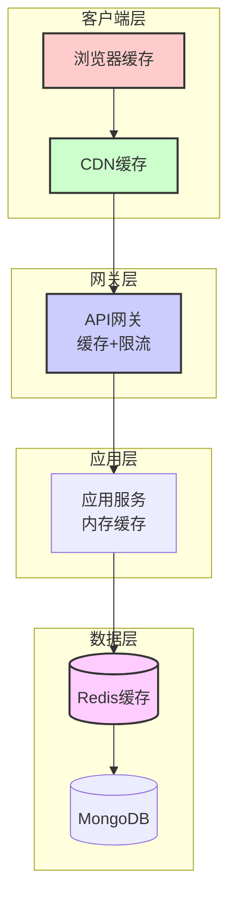

# 性能设计规范 (Performance Design Guidelines)

本文档定义了 Heimdall 博客系统的性能目标、优化策略、监控指标和性能测试方案。

## 1. 性能目标定义

### 1.1. 关键性能指标 (KPI)

**响应时间指标**:
- API响应时间 (P95): < 200ms
- 页面首屏时间 (FCP): < 1.5s
- 页面完全加载时间 (LCP): < 2.5s
- 交互响应时间 (FID): < 100ms

**吞吐量指标**:
- 并发用户数: 1000+ (正常情况)
- 峰值QPS: 500+ (Public API)
- 峰值QPS: 100+ (Admin API)
- 数据库连接池: 50+ 并发连接

**可用性指标**:
- 系统可用性: 99.9% (年停机时间 < 8.76小时)
- 错误率: < 0.1%
- 故障恢复时间: < 30分钟

### 1.2. 性能基准矩阵

| 场景 | 响应时间 (P95) | QPS | 并发数 | 内存使用 | CPU使用 |
|------|----------------|-----|--------|----------|---------|
| 文章列表查询 | 150ms | 200 | 500 | < 512MB | < 50% |
| 文章详情查询 | 100ms | 300 | 600 | < 256MB | < 30% |
| 用户登录 | 300ms | 50 | 100 | < 128MB | < 20% |
| 文章创建 | 500ms | 20 | 50 | < 256MB | < 40% |
| 文件上传 | 2000ms | 10 | 20 | < 1GB | < 60% |
| 全文搜索 | 800ms | 100 | 200 | < 512MB | < 70% |

## 2. 架构层面性能优化

### 2.1. 缓存架构设计



**多层缓存策略**:

1. **L1 - 浏览器缓存** (TTL: 24h):
   - 静态资源: CSS, JS, 图片
   - 缓存策略: Cache-Control, ETag
   - 更新机制: 版本号控制

2. **L2 - CDN缓存** (TTL: 1h-24h):
   - 静态文件和页面缓存
   - 全球边缘节点分发
   - 智能回源和预取

3. **L3 - API网关缓存** (TTL: 5-30min):
   - 热点API响应缓存
   - 个性化数据排除
   - 缓存穿透保护

4. **L4 - 应用内存缓存** (TTL: 1-10min):
   - 热点数据本地缓存
   - 减少Redis访问
   - LRU淘汰策略

5. **L5 - Redis分布式缓存** (TTL: 10min-24h):
   - 数据库查询结果缓存
   - 会话和状态存储
   - 计算结果缓存

### 2.2. 数据库性能优化

**索引策略**:
```javascript
// MongoDB 索引优化
// 1. 文章查询索引
db.posts.createIndex(
  { "status": 1, "publishedAt": -1 },
  { name: "idx_posts_status_published" }
);

// 2. 复合查询索引
db.posts.createIndex(
  { "authorId": 1, "status": 1, "publishedAt": -1 },
  { name: "idx_posts_author_status_published" }
);

// 3. 全文搜索索引
db.posts.createIndex(
  { "title": "text", "content": "text", "tags.name": "text" },
  { 
    name: "idx_posts_fulltext",
    weights: { "title": 10, "content": 5, "tags.name": 3 }
  }
);

// 4. 地理位置索引（如果需要）
db.users.createIndex(
  { "location": "2dsphere" },
  { name: "idx_users_location" }
);
```

**查询优化**:
```go
// ✅ 优化后的查询示例
func (d *PostDAO) GetPublishedPostList(ctx context.Context, filter PostFilter) ([]*model.Post, int64, error) {
    // 使用复合索引进行查询
    pipeline := []bson.M{
        // 1. 匹配条件（利用索引）
        {
            "$match": bson.M{
                "status": constants.PostStatusPublished,
                "publishedAt": bson.M{"$lte": time.Now()},
                "visibility": constants.VisibilityPublic,
            },
        },
        // 2. 字段投影（减少网络传输）
        {
            "$project": bson.M{
                "title": 1,
                "slug": 1,
                "excerpt": 1,
                "featuredImage": 1,
                "authorId": 1,
                "tags": 1,
                "publishedAt": 1,
                "readingTime": 1,
                "viewCount": 1,
                // 排除大字段
                "content": 0,
                "html": 0,
            },
        },
        // 3. 排序（利用索引）
        {
            "$sort": bson.M{"publishedAt": -1},
        },
        // 4. 分页
        {
            "$skip": filter.Offset,
        },
        {
            "$limit": filter.Limit,
        },
    }
    
    // 执行聚合查询
    cursor, err := d.collection.Aggregate(ctx, pipeline)
    // ... 处理结果
}
```

**连接池优化**:
```go
// MongoDB连接池配置
func NewMongoClient(uri string) (*mongo.Client, error) {
    opts := options.Client().ApplyURI(uri).
        SetMaxPoolSize(100).          // 最大连接数
        SetMinPoolSize(5).            // 最小连接数
        SetMaxConnIdleTime(30 * time.Minute). // 连接最大空闲时间
        SetConnectTimeout(10 * time.Second).   // 连接超时
        SetSocketTimeout(30 * time.Second).    // Socket超时
        SetServerSelectionTimeout(5 * time.Second) // 服务器选择超时
    
    return mongo.Connect(context.Background(), opts)
}
```

### 2.3. 微服务性能优化

**连接复用和Keep-Alive**:
```go
// HTTP客户端优化
func NewOptimizedHTTPClient() *http.Client {
    transport := &http.Transport{
        MaxIdleConns:        100,              // 最大空闲连接
        MaxIdleConnsPerHost: 10,               // 每个host最大空闲连接
        IdleConnTimeout:     90 * time.Second, // 空闲连接超时
        TLSHandshakeTimeout: 10 * time.Second, // TLS握手超时
        DialContext: (&net.Dialer{
            Timeout:   30 * time.Second, // 连接超时
            KeepAlive: 30 * time.Second, // Keep-Alive
        }).DialContext,
    }
    
    return &http.Client{
        Transport: transport,
        Timeout:   30 * time.Second,
    }
}
```

## 3. 应用层性能优化

### 3.1. Go服务优化

**内存优化**:
```go
// 对象池减少GC压力
var postPool = sync.Pool{
    New: func() interface{} {
        return &model.Post{}
    },
}

func (l *GetPostListLogic) GetPostList(req *types.GetPostListReq) (*types.GetPostListResp, error) {
    // 从对象池获取对象
    post := postPool.Get().(*model.Post)
    defer postPool.Put(post) // 归还对象池
    
    // 使用对象...
}

// 字符串构建优化
func buildPostURL(slug string) string {
    var builder strings.Builder
    builder.Grow(50) // 预分配容量
    builder.WriteString("/posts/")
    builder.WriteString(slug)
    return builder.String()
}
```

**并发优化**:
```go
// 并行处理减少响应时间
func (l *GetPostDetailLogic) GetPostDetail(req *types.GetPostDetailReq) (*types.GetPostDetailResp, error) {
    ctx := l.ctx
    
    // 并行获取数据
    var wg sync.WaitGroup
    var post *model.Post
    var comments []*model.Comment
    var author *model.User
    var err error
    
    // 获取文章基本信息
    wg.Add(1)
    go func() {
        defer wg.Done()
        post, err = l.svcCtx.PostDAO.GetBySlug(ctx, req.Slug)
    }()
    
    // 获取评论列表
    wg.Add(1)
    go func() {
        defer wg.Done()
        comments, _, _ = l.svcCtx.CommentDAO.GetByPostID(ctx, req.PostID, 1, 10)
    }()
    
    // 获取作者信息
    wg.Add(1)
    go func() {
        defer wg.Done()
        if post != nil {
            author, _ = l.svcCtx.UserDAO.GetByID(ctx, post.AuthorID)
        }
    }()
    
    wg.Wait()
    
    if err != nil {
        return nil, err
    }
    
    // 组装响应...
}
```

**缓存优化**:
```go
// 多级缓存实现
type CacheManager struct {
    localCache  *cache.Cache          // 本地缓存
    redisClient *redis.Client         // Redis缓存
}

func (c *CacheManager) Get(key string) (interface{}, error) {
    // L1: 本地缓存
    if val, found := c.localCache.Get(key); found {
        return val, nil
    }
    
    // L2: Redis缓存
    val, err := c.redisClient.Get(context.Background(), key).Result()
    if err == nil {
        // 回写本地缓存
        c.localCache.Set(key, val, 5*time.Minute)
        return val, nil
    }
    
    return nil, errors.New("cache miss")
}
```

### 3.2. 数据结构优化

**分页查询优化**:
```go
// 游标分页替代偏移分页
type CursorPagination struct {
    Cursor    string `json:"cursor"`
    Limit     int    `json:"limit"`
    HasNext   bool   `json:"hasNext"`
}

func (d *PostDAO) GetPostsByCursor(ctx context.Context, cursor string, limit int) ([]*model.Post, *CursorPagination, error) {
    filter := bson.M{"status": constants.PostStatusPublished}
    
    // 如果有游标，添加游标条件
    if cursor != "" {
        cursorTime, err := time.Parse(time.RFC3339, cursor)
        if err != nil {
            return nil, nil, err
        }
        filter["publishedAt"] = bson.M{"$lt": cursorTime}
    }
    
    opts := options.Find().
        SetSort(bson.D{{Key: "publishedAt", Value: -1}}).
        SetLimit(int64(limit + 1)) // 多查一条判断是否有下一页
    
    cursor, err := d.collection.Find(ctx, filter, opts)
    if err != nil {
        return nil, nil, err
    }
    
    var posts []*model.Post
    if err := cursor.All(ctx, &posts); err != nil {
        return nil, nil, err
    }
    
    // 判断是否有下一页
    hasNext := len(posts) > limit
    if hasNext {
        posts = posts[:limit]
    }
    
    // 构建下一页游标
    var nextCursor string
    if hasNext && len(posts) > 0 {
        nextCursor = posts[len(posts)-1].PublishedAt.Format(time.RFC3339)
    }
    
    pagination := &CursorPagination{
        Cursor:  nextCursor,
        Limit:   limit,
        HasNext: hasNext,
    }
    
    return posts, pagination, nil
}
```

## 4. 前端性能优化

### 4.1. 加载性能优化

**代码分割策略**:
```typescript
// 路由级别分割
import { lazy, Suspense } from 'react';

const AdminDashboard = lazy(() => import('./pages/AdminDashboard'));
const PostEditor = lazy(() => import('./pages/PostEditor'));
const PostList = lazy(() => import('./pages/PostList'));

// 组件级别分割
const RichTextEditor = lazy(() => import('./components/RichTextEditor'));
const ImageUploader = lazy(() => import('./components/ImageUploader'));

// 第三方库分割
import dynamic from 'next/dynamic';

const Chart = dynamic(() => import('recharts'), {
  ssr: false,
  loading: () => <div>Loading chart...</div>
});
```

**资源预加载**:
```tsx
// 关键资源预加载
export default function PostDetail({ post }: { post: Post }) {
  useEffect(() => {
    // 预加载相关文章
    if (post.relatedPosts) {
      post.relatedPosts.forEach(relatedPost => {
        // 预取关联文章数据
        queryClient.prefetchQuery(['post', relatedPost.slug], () =>
          fetchPost(relatedPost.slug)
        );
      });
    }
    
    // 预加载评论
    queryClient.prefetchQuery(['comments', post.id], () =>
      fetchComments(post.id)
    );
  }, [post.id]);

  return (
    <article>
      <PostContent post={post} />
      <Suspense fallback={<CommentsSkeleton />}>
        <Comments postId={post.id} />
      </Suspense>
    </article>
  );
}
```

### 4.2. 渲染性能优化

**虚拟滚动**:
```tsx
// 长列表虚拟滚动
import { FixedSizeList as List } from 'react-window';

interface PostListProps {
  posts: Post[];
}

const PostList: React.FC<PostListProps> = ({ posts }) => {
  const Row = useCallback(({ index, style }: { index: number; style: React.CSSProperties }) => (
    <div style={style}>
      <PostCard post={posts[index]} />
    </div>
  ), [posts]);

  return (
    <List
      height={600}
      itemCount={posts.length}
      itemSize={120}
      width="100%"
    >
      {Row}
    </List>
  );
};
```

**memo化优化**:
```tsx
// 组件memo化
const PostCard = React.memo(({ post }: { post: Post }) => {
  const handleClick = useCallback(() => {
    router.push(`/posts/${post.slug}`);
  }, [post.slug]);

  return (
    <article onClick={handleClick}>
      <h3>{post.title}</h3>
      <p>{post.excerpt}</p>
    </article>
  );
});

// Hook结果缓存
const usePostStats = (postId: string) => {
  return useMemo(() => ({
    viewCount: post.viewCount,
    commentCount: post.commentCount,
    likeCount: post.likeCount,
  }), [post.viewCount, post.commentCount, post.likeCount]);
};
```

## 5. 监控和测试

### 5.1. 性能监控指标

**应用性能监控 (APM)**:
```go
// Prometheus指标定义
var (
    // HTTP请求监控
    httpRequestDuration = prometheus.NewHistogramVec(
        prometheus.HistogramOpts{
            Name: "http_request_duration_seconds",
            Help: "HTTP request latency",
            Buckets: prometheus.DefBuckets,
        },
        []string{"method", "endpoint", "status_code"},
    )
    
    // 数据库查询监控
    dbQueryDuration = prometheus.NewHistogramVec(
        prometheus.HistogramOpts{
            Name: "db_query_duration_seconds",
            Help: "Database query latency",
            Buckets: []float64{0.001, 0.005, 0.01, 0.05, 0.1, 0.5, 1.0, 2.0, 5.0},
        },
        []string{"collection", "operation"},
    )
    
    // 缓存命中率监控
    cacheHitRate = prometheus.NewCounterVec(
        prometheus.CounterOpts{
            Name: "cache_requests_total",
            Help: "Cache requests total",
        },
        []string{"cache_type", "result"}, // result: hit/miss
    )
    
    // 业务指标监控
    postViewsTotal = prometheus.NewCounterVec(
        prometheus.CounterOpts{
            Name: "post_views_total",
            Help: "Total post views",
        },
        []string{"post_id"},
    )
)
```

**中间件集成**:
```go
// 性能监控中间件
func PerformanceMiddleware() gin.HandlerFunc {
    return gin.HandlerFunc(func(c *gin.Context) {
        start := time.Now()
        
        // 处理请求
        c.Next()
        
        // 记录指标
        duration := time.Since(start).Seconds()
        status := strconv.Itoa(c.Writer.Status())
        
        httpRequestDuration.WithLabelValues(
            c.Request.Method,
            c.FullPath(),
            status,
        ).Observe(duration)
        
        // 记录慢查询
        if duration > 1.0 {
            logrus.WithFields(logrus.Fields{
                "method":   c.Request.Method,
                "path":     c.Request.URL.Path,
                "duration": duration,
                "status":   status,
            }).Warn("Slow request detected")
        }
    })
}
```

### 5.2. 性能测试方案

**压力测试脚本**:
```bash
#!/bin/bash
# scripts/performance-test.sh

# K6 压力测试脚本
cat > load-test.js << 'EOF'
import http from 'k6/http';
import { check, sleep } from 'k6';

export let options = {
  stages: [
    { duration: '2m', target: 100 }, // 2分钟内增加到100用户
    { duration: '5m', target: 100 }, // 维持100用户5分钟
    { duration: '2m', target: 200 }, // 2分钟内增加到200用户
    { duration: '5m', target: 200 }, // 维持200用户5分钟
    { duration: '2m', target: 0 },   // 2分钟内降到0用户
  ],
  thresholds: {
    http_req_duration: ['p(95)<200'], // 95%请求在200ms内
    http_req_failed: ['rate<0.01'],   // 错误率小于1%
  },
};

export default function() {
  // 测试文章列表
  let response = http.get('http://localhost:8081/api/v1/public/posts');
  check(response, {
    'status is 200': (r) => r.status === 200,
    'response time < 200ms': (r) => r.timings.duration < 200,
  });
  
  sleep(1);
  
  // 测试文章详情
  response = http.get('http://localhost:8081/api/v1/public/posts/sample-post');
  check(response, {
    'status is 200': (r) => r.status === 200,
    'response time < 100ms': (r) => r.timings.duration < 100,
  });
  
  sleep(1);
}
EOF

# 运行压力测试
k6 run load-test.js
```

**基准测试**:
```go
// Go基准测试
func BenchmarkPostDAO_GetBySlug(b *testing.B) {
    // 设置测试数据
    dao := setupTestDAO()
    defer cleanupTestDAO(dao)
    
    slug := "test-post-slug"
    
    b.ResetTimer()
    b.RunParallel(func(pb *testing.PB) {
        for pb.Next() {
            _, err := dao.GetBySlug(context.Background(), slug)
            if err != nil {
                b.Error(err)
            }
        }
    })
}

func BenchmarkPostCache_Get(b *testing.B) {
    cache := setupTestCache()
    defer cleanupTestCache(cache)
    
    key := "post:test-slug"
    value := &model.Post{Title: "Test Post"}
    cache.Set(key, value)
    
    b.ResetTimer()
    b.RunParallel(func(pb *testing.PB) {
        for pb.Next() {
            _, err := cache.Get(key)
            if err != nil {
                b.Error(err)
            }
        }
    })
}
```

## 6. 性能优化最佳实践

### 6.1. 开发阶段

**代码审查检查清单**:
- [ ] 数据库查询是否使用了合适的索引
- [ ] 是否存在N+1查询问题
- [ ] 大数据量处理是否使用了分页或流式处理
- [ ] 缓存策略是否合理
- [ ] 是否存在内存泄漏风险
- [ ] 并发处理是否安全高效
- [ ] 函数复杂度是否控制在合理范围（遵循40行原子化规范）

### 6.2. 部署阶段

**生产环境优化**:
```yaml
# 容器资源配置
resources:
  requests:
    memory: "256Mi"
    cpu: "200m"
  limits:
    memory: "512Mi"
    cpu: "500m"

# JVM调优（如果使用Java）
env:
  - name: JAVA_OPTS
    value: "-Xms512m -Xmx1024m -XX:+UseG1GC"

# Go程序优化
env:
  - name: GOGC
    value: "100"
  - name: GOMAXPROCS
    value: "4"
```

### 6.3. 运维阶段

**性能监控告警规则**:
```yaml
# Prometheus告警规则
groups:
- name: performance-alerts
  rules:
  # API响应时间告警
  - alert: HighAPILatency
    expr: histogram_quantile(0.95, rate(http_request_duration_seconds_bucket[5m])) > 0.2
    for: 2m
    labels:
      severity: warning
    annotations:
      summary: "High API latency detected"
      description: "95th percentile latency is {{ $value }}s"

  # 数据库连接池告警
  - alert: HighDBConnections
    expr: mongodb_connections{state="current"} / mongodb_connections{state="available"} > 0.8
    for: 1m
    labels:
      severity: warning
    annotations:
      summary: "High database connection usage"
      description: "Database connection usage is {{ $value | humanizePercentage }}"

  # 缓存命中率告警
  - alert: LowCacheHitRate
    expr: rate(cache_requests_total{result="hit"}[5m]) / rate(cache_requests_total[5m]) < 0.8
    for: 5m
    labels:
      severity: warning
    annotations:
      summary: "Low cache hit rate"
      description: "Cache hit rate is {{ $value | humanizePercentage }}"
```

---

**注意**: 性能优化是一个持续的过程，需要根据实际业务增长和用户反馈不断调整优化策略。建议定期进行性能基准测试，及时发现和解决性能瓶颈。 