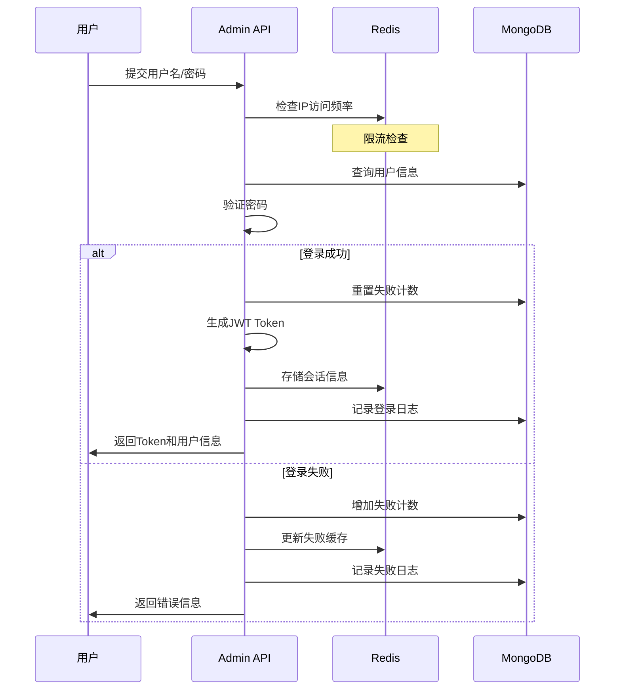

# 安全设计规范 (Security Design Guidelines)

本文档详细定义了 Heimdall 项目的安全架构设计，特别是针对 Admin API 的账号密码登录机制和多重安全防护策略。

## 1. 安全架构概览

### 1.1. 安全设计原则

- **多层防护**: 采用多层次的安全防护机制，确保单点失效不影响整体安全
- **最小权限**: 用户只能访问其职责范围内的功能和数据
- **零信任**: 对所有请求都进行身份验证和权限检查
- **审计追踪**: 记录所有敏感操作和安全事件
- **主动防御**: 采用主动的异常检测和防护机制

### 1.2. 威胁模型分析

**主要威胁**:
- 暴力破解攻击
- 凭证填充攻击
- 会话劫持
- 权限提升
- SQL注入/NoSQL注入
- XSS攻击
- CSRF攻击

**防护措施**:
- 密码强度要求 + 登录失败锁定
- JWT令牌 + 会话管理
- RBAC权限控制 + 操作审计
- 参数验证 + 输入清理
- API限流 + 异常检测

## 2. 身份认证 (Authentication)

### 2.1. 用户登录流程



### 2.2. 密码安全策略

**密码要求**:
- 最小长度: 8 个字符
- 必须包含: 大写字母、小写字母、数字、特殊符号中的至少 3 种
- 不能包含用户名、邮箱地址的任何部分
- 不能使用常见弱密码（维护黑名单）

**密码存储**:
- 使用 bcrypt 算法进行加密存储
- 成本因子设置为 12（推荐值）
- 从不记录或传输明文密码

### 2.3. 登录失败防护

**失败计数策略**:
- 连续失败 3 次: 锁定 15 分钟
- 连续失败 5 次: 锁定 1 小时
- 连续失败 10 次: 锁定 24 小时
- 锁定期间的登录尝试不重置计数

**IP 访问控制**:
- 同一IP每分钟最多 5 次登录尝试
- 异常IP自动加入临时黑名单
- 支持管理员配置IP白名单

## 3. 授权与权限控制 (Authorization)

### 3.1. 基于角色的访问控制 (RBAC)

**角色定义**:
- **Owner**: 博客所有者，拥有所有权限
- **Admin**: 管理员，除所有者设置外的所有权限
- **Editor**: 编辑，可管理所有内容和评论
- **Author**: 作者，只能管理自己创建的内容

**权限矩阵**:

| 功能模块     | Owner | Admin | Editor | Author |
| ------------ | ----- | ----- | ------ | ------ |
| 用户管理     | ✅     | ✅     | ❌      | ❌      |
| 系统设置     | ✅     | ✅     | ❌      | ❌      |
| 所有文章管理 | ✅     | ✅     | ✅      | ❌      |
| 自己文章管理 | ✅     | ✅     | ✅      | ✅      |
| 评论管理     | ✅     | ✅     | ✅      | ❌      |
| 媒体管理     | ✅     | ✅     | ✅      | ✅      |

### 3.2. JWT 令牌设计

**令牌结构**:
```json
{
  "header": {
    "alg": "HS256",
    "typ": "JWT"
  },
  "payload": {
    "sub": "用户ID",
    "username": "用户名",
    "role": "用户角色",
    "iat": "签发时间",
    "exp": "过期时间",
    "jti": "令牌唯一标识"
  }
}
```

**令牌管理**:
- 访问令牌有效期: 2 小时
- 刷新令牌有效期: 7 天
- 支持令牌黑名单机制
- 异常登录自动吊销所有令牌

## 4. API 安全防护

### 4.1. 请求限流策略

**限流规则**:
- 登录接口: 每IP每分钟 5 次
- 写操作接口: 每用户每分钟 30 次
- 读操作接口: 每用户每分钟 100 次
- 媒体上传: 每用户每分钟 10 次

**限流实现**:
- 使用 Redis 实现滑动窗口限流
- 基于 IP + 用户ID 的复合限流
- 超限请求返回 429 状态码

### 4.2. 输入验证与防护

**参数验证**:
- 所有输入参数进行类型、长度、格式验证
- 使用白名单方式验证枚举值
- 特殊字符转义和SQL注入防护

**XSS 防护**:
- 用户输入的HTML内容使用安全清理库
- 响应头设置 `X-XSS-Protection`
- CSP (Content Security Policy) 配置

**CSRF 防护**:
- 验证 `Origin` 和 `Referer` 头
- 关键操作使用双重提交Cookie
- SameSite Cookie 属性设置

## 5. 会话安全管理

### 5.1. 会话存储策略

**Redis 会话存储**:
```
Key: session:{userId}:{jti}
Value: {
  "userId": "用户ID",
  "username": "用户名", 
  "role": "用户角色",
  "loginTime": "登录时间",
  "lastActivity": "最后活动时间",
  "ipAddress": "登录IP",
  "userAgent": "用户代理"
}
TTL: 7200 秒 (2小时)
```

### 5.2. 会话安全措施

**会话保护**:
- 登录成功后重新生成会话ID
- 检测异常登录地点和设备
- 支持强制注销所有会话
- 会话固定攻击防护

**并发会话控制**:
- 单用户最多 3 个并发会话
- 新会话自动踢出最旧会话
- 支持查看和管理活跃会话

## 6. 安全监控与审计

### 6.1. 操作审计日志

**记录的操作**:
- 用户登录/登出
- 权限变更操作
- 敏感数据修改
- 系统配置变更
- 异常访问尝试

**日志格式**:
```json
{
  "timestamp": "2024-01-01T12:00:00Z",
  "userId": "用户ID",
  "username": "用户名",
  "action": "操作类型",
  "resource": "操作资源",
  "ipAddress": "客户端IP",
  "userAgent": "用户代理",
  "success": true,
  "details": "详细信息"
}
```

### 6.2. 异常检测与告警

**异常行为检测**:
- 短时间内大量失败登录
- 异常时间段的操作
- 权限范围外的访问尝试
- API调用频率异常

**告警机制**:
- 关键安全事件实时告警
- 每日安全摘要报告
- 异常IP自动封禁
- 管理员邮件通知

## 7. 部署安全配置

### 7.1. 网络安全配置

**防火墙配置**:
- 只开放必要的端口 (443, 80)
- 限制数据库端口访问
- 配置DDoS防护
- 启用Web应用防火墙(WAF)

**HTTPS 配置**:
- 强制HTTPS访问
- 使用TLS 1.2及以上版本
- 配置HSTS头
- 证书自动更新

### 7.2. 应用安全配置

**环境变量管理**:
- 敏感配置通过环境变量传递
- JWT密钥定期轮换
- 数据库连接字符串加密
- API密钥安全存储

**容器安全**:
- 使用最小权限运行
- 定期更新基础镜像
- 禁用不必要的服务
- 容器镜像安全扫描

## 8. 安全开发规范

### 8.1. 代码安全要求

**安全编码原则**:
- 输入验证优先
- 错误处理不泄露敏感信息
- 使用安全的加密算法
- 避免硬编码敏感信息

**安全审查**:
- 代码审查包含安全检查
- 使用静态代码安全扫描
- 定期进行渗透测试
- 依赖库安全漏洞扫描

### 8.2. 安全测试策略

**测试覆盖**:
- 认证功能单元测试
- 权限控制集成测试
- 安全漏洞专项测试
- 性能和压力测试

**测试工具**:
- gosec (Go安全扫描)
- OWASP ZAP (渗透测试)
- sqlmap (SQL注入测试)
- nmap (网络扫描)

---

**注意**: 安全是一个持续的过程，需要定期评估和改进。本文档应根据威胁变化和业界最佳实践进行更新。 