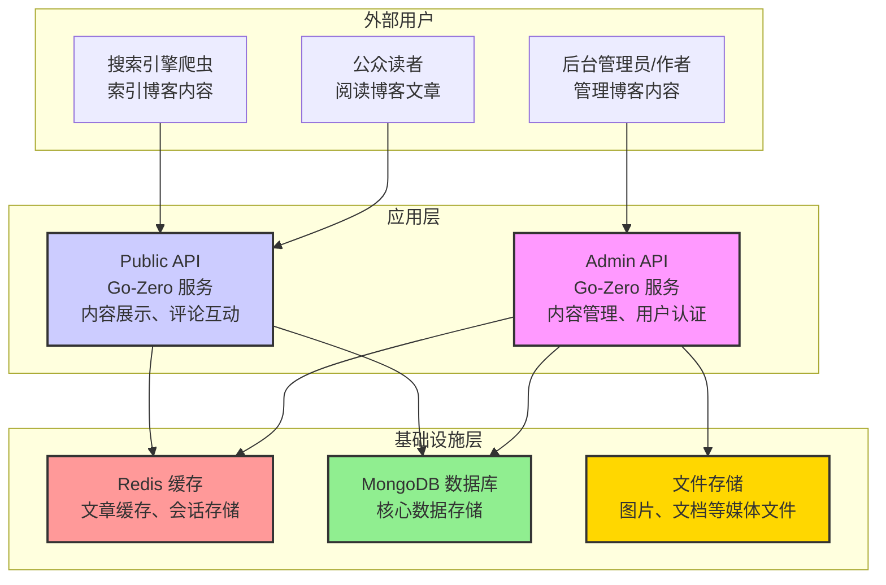

 # 系统架构与模块划分设计

本文档旨在提供 Heimdall 博客项目自顶向下的系统架构设计和详细的模块划分方案。

## 1. 系统架构总览 (C4 - System Context)

为了清晰地展示系统边界和核心组件，我们采用 C4 模型中的系统上下文图来描绘整体架构。



**架构解读**:

- **三类用户**: 系统支持三类用户访问：**后台管理者**、**公众读者** 和 **搜索引擎爬虫**。
- **微服务架构**: 核心后端被拆分为两个独立部署的微服务：
    - **`Admin API`**: 负责处理所有需要认证和授权的管理类操作，通过强化的身份验证和权限控制确保安全性。
    - **`Public API`**: 负责处理所有公开内容的读取请求，部署在公网，支持高并发访问。
- **多层存储**: 
    - **MongoDB**: 作为主数据库存储核心业务数据（用户、文章、评论等）。
    - **Redis**: 作为缓存层提升读取性能，存储热点数据和会话信息。
    - **文件存储**: 存储图片、文档等媒体文件，可以是本地存储或云存储（如腾讯云COS）。
- **缓存策略**: Public API 重度依赖 Redis 缓存来应对高并发访问，Admin API 使用 Redis 存储用户会话。

## 2. 模块详细划分

基于微服务架构，我们将系统组织为统一的 Go 模块结构，包含三个主要包：`admin-api`, `public-api`, 和 `common`。

### 2.1. `admin-api` (后台管理服务)

- **目标用户**: 博客管理员、编辑、作者。
- **核心职责**: 提供安全、可靠的内容管理和后台维护功能。
- **安全策略**: 通过多层身份验证、权限控制、API限流等机制确保安全性。
- **功能模块**:
    - **用户与权限模块 (User & Access)**:
        - 负责用户注册（邀请制）、账号密码登录、JWT生成与验证。
        - 实现多重安全机制：密码强度检查、登录失败锁定、会话管理。
        - 实现基于角色的访问控制 (RBAC)，区分 Owner, Admin, Editor, Author 等角色。
        - 支持操作审计日志，记录所有敏感操作。
    - **内容管理模块 (Content Management)**:
        - 提供文章、页面等内容的完整 CRUD (创建、读取、更新、删除) 操作。
        - 管理文章状态（草稿、已发布、定时发布、归档）。
        - 处理 SEO 相关的元数据，如 `slug`, `meta description`。
        - 管理标签 (Tags) 和分类 (Categories)。
    - **评论审核模块 (Comment Moderation)**:
        - 提供评论的审批、拒绝、删除、标记为垃圾等管理功能。
    - **站点设置模块 (Site Settings)**:
        - 管理博客的全局配置，如网站标题、Logo、导航菜单、主题颜色等。
    - **媒体管理模块 (Media Management)**:
        - 处理图片、文档等文件的上传、存储和管理。
        - 支持图片压缩、格式转换、多尺寸生成等功能。
        - 管理媒体文件的元数据和访问权限。

### 2.2. `public-api` (前台公开服务)

- **目标用户**: 博客的公众读者、搜索引擎爬虫、第三方应用。
- **核心职责**: 高性能、高可用地提供博客内容。
- **部署建议**: 部署于公网，可水平扩展以应对高并发访问。
- **功能模块**:
    - **内容展示模块 (Content Display)**:
        - 提供文章列表的分页查询。
        - 提供单篇文章、页面的详情查询。
        - 提供按标签、作者、日期归档的查询。
    - **内容发现模块 (Content Discovery)**:
        - 提供全文搜索功能。
        - 提供所有标签的列表（标签云）。
    - **互动系统模块 (Interaction System)**:
        - 展示已审核通过的评论列表（支持嵌套）。
        - 接收并保存用户提交的新评论（初始状态为待审核）。
    - **集成与SEO模块 (Integration & SEO)**:
        - 生成 `sitemap.xml` 以便搜索引擎收录。
        - 提供 RSS/Atom feed 供用户订阅。

### 2.3. `common` (共享包)

- **性质**: 可被 `admin-api` 和 `public-api` 同时引用的 Go 包，不包含任何业务逻辑。
- **核心职责**: 提供跨服务复用的基础代码和定义，避免代码重复。
- **包含内容**:
    - **数据模型 (`model/`)**: 定义与 MongoDB 集合一一对应的 Go Struct。
    - **数据访问层 (`dao/`)**: 封装对 MongoDB 的所有数据库操作，为上层提供统一的数据访问接口。
    - **缓存层 (`cache/`)**: 封装对 Redis 的操作，提供统一的缓存接口。
    - **安全模块 (`security/`)**: 提供密码加密、JWT处理、权限验证、登录锁定等安全功能。
    - **第三方客户端 (`client/`)**: 封装对外部服务的调用，如文件存储、邮件服务等。
    - **业务常量 (`constants/`)**: 定义系统中使用的所有魔法字符串和枚举值，如用户角色、文章状态等。
    - **工具函数 (`utils/`)**: 提供通用的辅助函数，如密码处理、分页计算、Markdown渲染等。
    - **错误定义 (`errors/`)**: 定义统一的业务错误类型，方便在服务间传递和处理。

## 3. Go 模块结构设计

### 3.1. 统一模块架构

项目采用**统一 Go 模块**架构，所有代码位于一个 `go.mod` 文件管理下：

```
github.com/heimdall-api/
├── go.mod                      # 统一的模块定义
├── admin-api/                  # 管理服务包
├── public-api/                 # 公开服务包  
└── common/                     # 共享代码包
```

### 3.2. 架构优势

**相比多模块架构的优势**:
- ✅ **依赖管理简化**: 避免复杂的模块间版本依赖问题
- ✅ **构建效率提升**: 统一构建，减少重复编译
- ✅ **代码共享便利**: 直接引用内部包，无需模块发布
- ✅ **重构友好**: 跨包重构更加安全和便捷
- ✅ **CI/CD 简化**: 单一构建流程，测试覆盖更全面

**包导入示例**:
```go
// 在 admin-api 中引用 common 包
import (
    "github.com/heimdall-api/common/model"
    "github.com/heimdall-api/common/dao"
)

// 在 public-api 中引用 common 包  
import (
    "github.com/heimdall-api/common/model"
    "github.com/heimdall-api/common/utils"
)
```

### 3.3. 开发工作流

```bash
# 项目根目录操作
go mod tidy                    # 整理所有依赖
go build ./admin-api/...       # 构建管理服务
go build ./public-api/...      # 构建公开服务  
go test ./...                  # 运行全项目测试
go run ./admin-api/admin       # 启动管理服务
go run ./public-api/public     # 启动公开服务
```

## 4. 技术栈选型

### 3.1. 核心技术栈
- **后端语言**: Go 1.24.4+
- **Web 框架**: go-zero
- **数据库**: MongoDB 5.0+
- **缓存**: Redis 6.0+
- **认证方式**: JWT (JSON Web Token)

### 3.2. 开发和测试工具
- **测试框架**: goconvey (BDD), mockey (Mock)
- **API 规范**: RESTful JSON API
- **文档生成**: goctl 自动生成 API 文档
- **代码质量**: golangci-lint (含函数长度检查), gosec
- **安全工具**: bcrypt (密码加密), rate limiter (API限流)
- **函数原子化**: 单个函数不超过40行（建议）、50行（强制）

### 3.3. 第三方服务
- **文件存储**: 本地存储 / 腾讯云COS
- **邮件服务**: SMTP / 第三方邮件服务
- **Markdown 渲染**: goldmark
- **图片处理**: imaging (Go 图片处理库)

### 3.4. 部署和监控
- **容器化**: Docker + Docker Compose
- **监控**: Prometheus + Grafana (可选)
- **日志**: 结构化日志 (JSON 格式)

## 4. 数据流向

### 4.1. 写操作流程 (内容创建/修改)
1. `管理员/作者` -> `Admin API` -> `业务逻辑处理` -> `DAO` -> `MongoDB`
2. `Admin API` -> `清除相关缓存` -> `Redis`
3. `Admin API` -> `处理媒体文件` -> `文件存储`

### 4.2. 读操作流程 (内容浏览)
1. `读者` -> `Public API` -> `检查缓存` -> `Redis`
   - **缓存命中**: 直接返回缓存数据
   - **缓存未命中**: 继续下一步
2. `Public API` -> `业务逻辑处理` -> `DAO` -> `MongoDB`
3. `Public API` -> `写入缓存` -> `Redis`
4. 返回数据给用户

### 4.3. 媒体文件访问流程
1. `用户` -> `请求媒体文件` -> `文件存储`
2. 静态文件直接返回，无需经过应用服务器

### 4.4. 缓存策略
- **热点数据**: 文章列表、热门文章、标签云等缓存 1 小时
- **稳定数据**: 已发布文章内容缓存 24 小时
- **用户会话**: JWT Token 黑名单和用户会话信息
- **安全数据**: 登录失败次数、IP访问频率、用户锁定状态等
- **缓存失效**: 内容更新时主动清除相关缓存

这种设计确保了读写分离和高性能缓存，为高并发访问奠定了基础。
